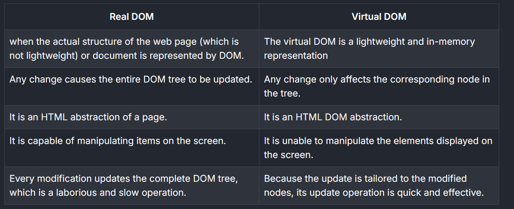

node -v

# What is React?

React is a free and open-source front-end JavaScript library for building user interfaces or UI components. 
React allows developers to create large web applications that can update and render efficiently in response to data changes.

### Key Features of React:
- **Component-Based**: Build encapsulated components that manage their own state and compose them to create complex UIs.
- **Declarative**: Design simple views for each state in your application, and React will efficiently update and render the right components when your data changes.
- **Virtual DOM**: React uses a virtual DOM to improve performance by minimizing direct manipulation of the real DOM.
- **Unidirectional Data Flow**: Data flows in a single direction, making the application easier to debug and understand.

### Virtual DOM vs Real DOM

The **Virtual DOM** and **Real DOM** are key concepts in modern web development, especially when working with libraries like React. Here's a comparison:



In summary, the Virtual DOM enhances performance by reducing the overhead of direct manipulation of the Real DOM, making it ideal for dynamic and interactive web applications.

React can be used as a base in the development of single-page or mobile applications. It is often used with other libraries or frameworks like Redux for state management or Next.js for server-side rendering.

For more information, visit the [official React documentation](https://reactjs.org/).

### Why React?

React is a popular choice for developers due to its flexibility, performance, and ease of use. Here are some reasons why React stands out:

- **Reusable Components**: React's component-based architecture allows developers to reuse code, making development faster and more efficient.
- **Strong Community Support**: With a large and active community, React offers extensive resources, libraries, and tools to help developers solve problems and build robust applications.
- **Cross-Platform Development**: React Native, a framework based on React, enables developers to build mobile applications for iOS and Android using the same principles and codebase.
- **Rich Ecosystem**: React integrates seamlessly with other tools and libraries, such as Redux, React Router, and Axios, to enhance functionality and streamline development.
- **SEO-Friendly**: React's server-side rendering capabilities improve search engine optimization, making it a great choice for web applications.

React's versatility and developer-friendly features make it a go-to library for building modern, dynamic, and scalable applications.


what we need 
any text editor I am going to use VS code  // company portal
Need to install node js // company portal


NPM Node Package Manager
NPX Node Package executer

SWC
SWC stands for Speedy Web Compiler — it's a super-fast JavaScript/TypeScript compiler written in Rust. When you're creating a React app with Vite, SWC can be used as an alternative to Babel for transforming your code.

Babel
Babel is a JavaScript compiler that lets you write modern JavaScript (ES6+), and then converts it into code that older browsers can understand.

<!-- ============================================== -->
JSX (JavaScript XML) is a syntax extension for JavaScript that allows you to write HTML-like code within JavaScript. It is commonly used in React to describe the structure of the user interface. JSX makes it easier to create React components by combining HTML-like syntax with JavaScript logic.

### JSX vs React.createElement

JSX is a syntax sugar for `React.createElement`. The following example demonstrates how JSX is transpiled into `React.createElement` calls:

#### JSX Example:
```jsx
<div>
  <h1>Hello, React!</h1>
  <p>This is an example of JSX.</p>
</div>
```

#### Equivalent React.createElement Code:
```js
function App() {
  return React.createElement(
      "div",
      null,
      React.createElement("h1", null, "Hello, React!"),
      React.createElement("p", null, "This is an example of JSX.")
    );
  
}
```

Both approaches achieve the same result, but JSX is more concise and easier to read, making it the preferred choice for most developers.

```js
const useState = [2, 4]

const [num1, num2] = useState

console.log(num1)
console.log(num2)

const person = {
  name: "Tony",
  age: 40,
  address :{
    city: "Pune",
    pin: 234234
  }
}

const { address: { city }} = person
console.log(city)
```